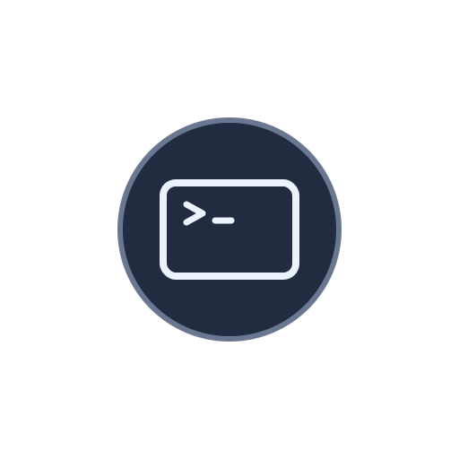
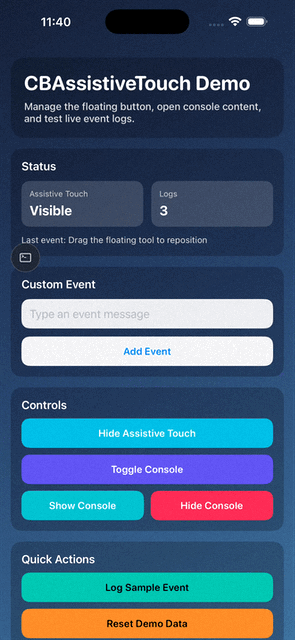

<div align="left">
  
</div>

# CBAssistiveTouch

`CBAssistiveTouch` is an iOS Swift package for building a draggable floating tool button (AssistiveTouch-style) with optional expandable content.

This repository currently exposes two Swift Package products:
- `CBAssistiveTouch`: core floating button and content presentation APIs.
- `CBLoggerWindow`: a ready-to-use floating logger console built on top of `CBAssistiveTouch`.

## Demo



## Requirements

- iOS 15.0+
- Swift 5.10+

## Installation (Swift Package Manager)

Add the package in Xcode (`File` -> `Add Package Dependencies...`) or in `Package.swift`:

```swift
dependencies: [
    .package(url: "https://github.com/cardinalblue/CBAssistiveTouch.git", from: "2.0.0")
]
```

Then add one or both products to your target:

```swift
.product(name: "CBAssistiveTouch", package: "CBAssistiveTouch")
.product(name: "CBLoggerWindow", package: "CBAssistiveTouch")
```

## Quick Start (`CBAssistiveTouch`)

```swift
import CBAssistiveTouch
import UIKit

@MainActor
final class DebugTools {
    private var assistiveTouch: AssistiveTouch?

    func install(on window: UIWindow) {
        let contentViewController = UIViewController()
        contentViewController.view.backgroundColor = .systemBackground
        contentViewController.preferredContentSize = CGSize(width: 320, height: 360)

        let layout = DefaultAssistiveTouchLayout(applicationWindow: window)
        layout.margin = 16

        assistiveTouch = AssistiveTouch(
            applicationWindow: window,
            layout: layout,
            contentViewController: contentViewController
        )
        assistiveTouch?.show()
    }
}
```

Main controls:
- `show()`, `hide()`, `toggle()`
- `showContent()`, `hideContent()`, `toggleContent()`

## Customize the Floating View

```swift
let layout = DefaultAssistiveTouchLayout(applicationWindow: window)
let iconView = UIImageView(image: UIImage(systemName: "hammer.fill"))
iconView.tintColor = .white
iconView.backgroundColor = .systemBlue
iconView.contentMode = .center
iconView.frame = CGRect(x: 0, y: 0, width: 44, height: 44)
iconView.layer.cornerRadius = 22
iconView.layer.masksToBounds = true

layout.customView = iconView
layout.assistiveTouchSize = iconView.bounds.size
layout.margin = 16
```

You can also provide your own `AssistiveTouchLayout` implementation if the default layout is not enough.

## Touch Passthrough in Presented Content

If your presented view controller should allow touches to pass through specific areas, conform to `ATPassthroughable`:

```swift
import CBAssistiveTouch

extension DebugPanelViewController: ATPassthroughable {
    func shouldPassthroughTouch(at point: CGPoint) -> Bool {
        // Return true for areas that should pass touches to underlying views.
        return false
    }
}
```

## Quick Start (`CBLoggerWindow`)

### SwiftUI App demo

```swift
import CBLoggerWindow
import SwiftUI
import UIKit

@main
struct DemoApp: App {
    @StateObject private var loggerController = LoggerDemoController()

    var body: some Scene {
        WindowGroup {
            ContentView()
                .environmentObject(loggerController)
                .onAppear { loggerController.configureIfNeeded() }
        }
    }
}

@MainActor
final class LoggerDemoController: ObservableObject {
    private var loggerWindow: CBLoggerWindow?

    func configureIfNeeded() {
        guard loggerWindow == nil else { return }
        guard let window = UIApplication.shared.cbatKeyWindow else { return }

        let loggerWindow = CBLoggerWindow(applicationWindow: window, margin: 16)
        loggerWindow.show()
        loggerWindow.log(event: "SwiftUI demo ready")
        self.loggerWindow = loggerWindow
    }

    func log(_ event: String) {
        loggerWindow?.log(event: event)
    }

    func toggleConsole() {
        loggerWindow?.toggleContent()
    }
}

private extension UIApplication {
    var cbatKeyWindow: UIWindow? {
        connectedScenes
            .compactMap { $0 as? UIWindowScene }
            .flatMap(\.windows)
            .first(where: \.isKeyWindow)
    }
}
```

### UIKit demo

```swift
import CBLoggerWindow
import UIKit

final class SceneDelegate: UIResponder, UIWindowSceneDelegate {
    var window: UIWindow?
    private var loggerWindow: CBLoggerWindow?

    func scene(
        _ scene: UIScene,
        willConnectTo session: UISceneSession,
        options connectionOptions: UIScene.ConnectionOptions
    ) {
        guard let windowScene = scene as? UIWindowScene else { return }

        let window = UIWindow(windowScene: windowScene)
        window.rootViewController = UIViewController()
        window.makeKeyAndVisible()
        self.window = window

        let loggerWindow = CBLoggerWindow(applicationWindow: window, margin: 16)
        loggerWindow.show()
        loggerWindow.log(event: "UIKit demo ready")
        self.loggerWindow = loggerWindow
    }
}
```

## Demo App

- A demo app is included in `Demo/`.
- Main demo controller: `Demo/Demo/AssistiveTouchDemoController.swift`.

## Development Setup

Install local development dependencies:

```bash
npm install
mise install
```

Generate the Demo project with Tuist:

```bash
cd Demo
mise exec -- tuist install
mise exec -- tuist generate
```

## Development Notes

- Lint rules are in `.swiftlint.yml`.
- Tool versions are pinned in `.mise.toml` (SwiftLint).
- Git pre-push hook (`.husky/pre-push`) runs SwiftLint in strict mode (changed files on feature branches, all files on base branch).

## License

MIT. See `LICENSE`.
